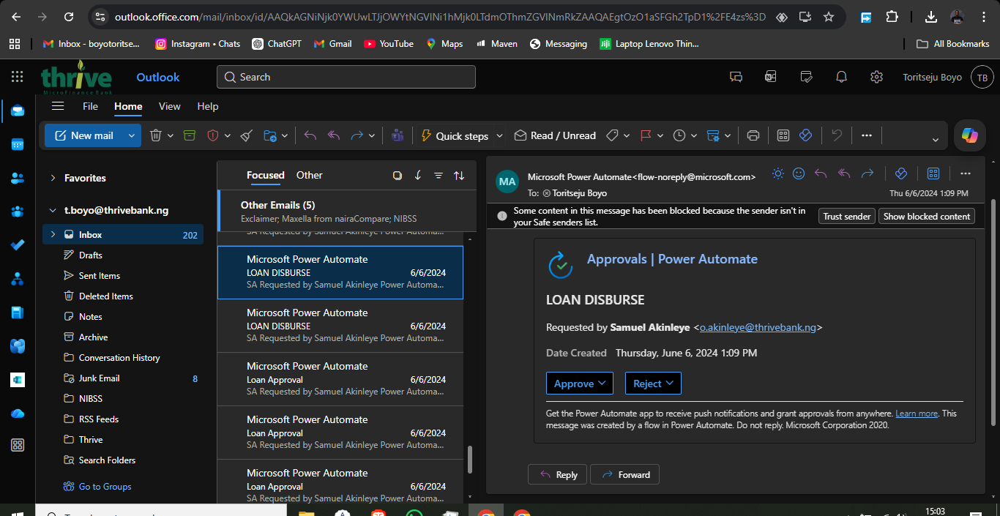
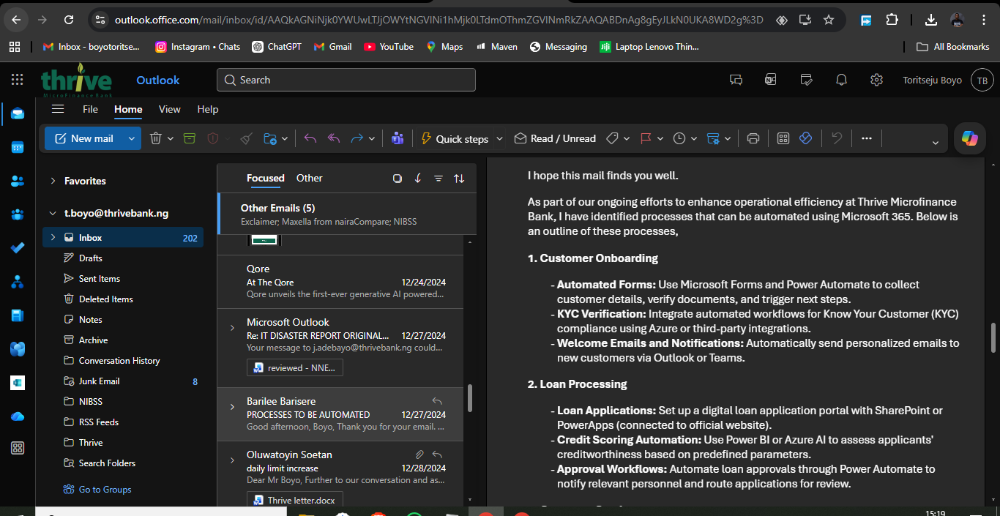

# Loan-Disbursement-Automation-Flow-Power-Automate-SharePoint-

# Loan Disbursement Automation – Power Automate & SharePoint

## 1. Project Overview

This project documents the design and implementation of an automated loan disbursement workflow using Microsoft Power Automate and SharePoint at Thrive Microfinance Bank.

The objective was to eliminate manual approval processes, improve processing speed, and ensure traceability of loan disbursement requests.

---

## 2. Problem Statement

The loan disbursement process was previously manual, resulting in:

- Delays in approval cycles  
- Lack of visibility across approval stages  
- High dependency on email-based communication  
- Increased risk of human error  

---

## 3. Solution Implemented

Designed and deployed an automated workflow using Microsoft Power Automate.

Key components:

- Trigger: Loan disbursement request initiation  
- Workflow engine: Power Automate  
- Approval system: Multi-step approval flow  
- Notifications: Automated email alerts  
- Data handling: Integrated with SharePoint  

---

## 4. Workflow Design

- Loan request is submitted  
- Approval request is triggered automatically  
- Approvers receive actionable email (Approve / Reject)  
- Decision updates workflow status in real-time  
- Notifications sent to relevant stakeholders  

---

## 5. Automation Implementation

- Configured approval flows using Power Automate  
- Integrated email-based approval system  
- Ensured real-time response tracking  
- Reduced dependency on manual follow-ups  

---

## 6. Process Automation Scope

- Customer onboarding linkage (if applicable)  
- Loan processing automation  
- Notification automation (Outlook / Teams)  
- Workflow routing and escalation  

---

## 7. Measurable Impact

- Reduced loan approval turnaround time from [X hours/days → Y hours]  
- Eliminated manual approval tracking process  
- Improved visibility across approval stages  
- Reduced processing delays caused by communication gaps  

---

## 8. Technologies Used

- Microsoft Power Automate  
- Microsoft 365 (Outlook, SharePoint)  
- Workflow Automation  
- Approval Systems  

---

## 9. Key Skills Demonstrated

- Workflow Automation Design  
- Process Optimization  
- Microsoft Power Platform  
- Business Process Re-engineering  
- System Integration  
